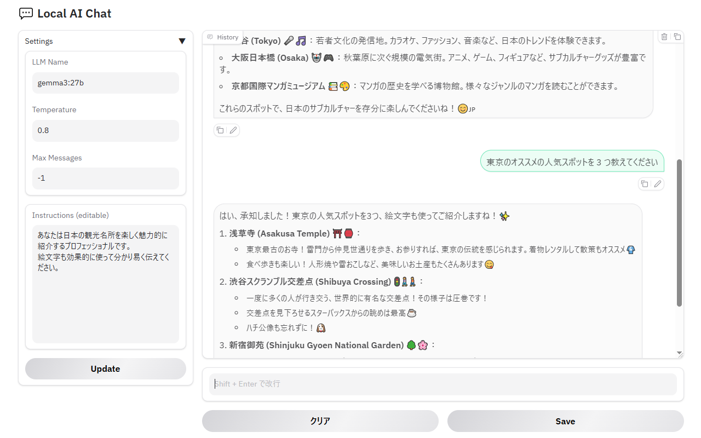

# local-ai-chat

[日本語 Readme](./README.ja.md)

## 1. Overview

- Local AI Chat App
- Built with [Ollama](https://github.com/ollama/ollama) and [Gradio](https://www.gradio.app/)
- Runs entirely on your local machine with no external data transfers



## 2. Usage

1. Set up environment variables
2. Run the app
3. Chat with the AI via web browser

### 2.1. Environment Variables

Environment variables are required.

Create a `.env` file at the project root in your local environment and set the environment variables.  
See [.env.example](./.env.example) for reference.

Available environment variables:

- LOG_LEVEL
  - Log level (`DEBUG`, `INFO`, `WARNING`, `ERROR`)
- LLM_NAME
  - Name of the LLM (e.g. qwen2.5:32b, gemma3:27b)
- LLM_ENDPOINT
  - URL of the LLM API (e.g. `http://localhost:11434/`)
- LLM_TEMPERATURE
  - Sampling temperature of the LLM (0.0-1.0)
- LLM_MAX_MESSAGES
  - Maximum number of messages to include in the conversation history passed to the LLM (<0: unlimited)
  - The most recent messages are prioritized up to the maximum count
- LLM_INSTRUCTION_FILE_PATH
  - File path for the system prompt file used as instructions for the LLM (e.g. `data/llm_instruction.txt`)
- LLM_MESSAGE_EXAMPLE_FILE_PATH
  - File path for the example conversation between user and AI (e.g. `data/llm_message_example.json`)
  - Included in the conversation history as preceding messages

### 2.2. Running the App

```sh
poetry run python app/main.py
```

## 3.Repository

- [Bubbles877/local-ai-chat](https://github.com/Bubbles877/local-ai-chat)
